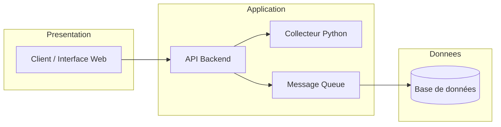
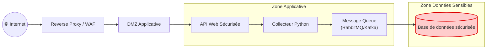
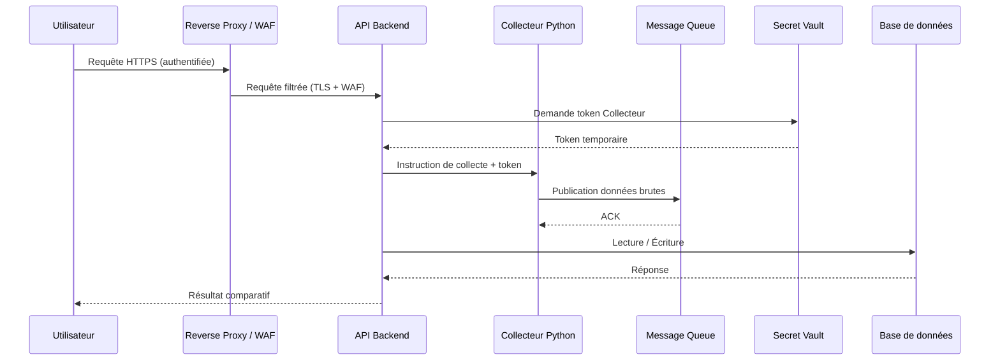
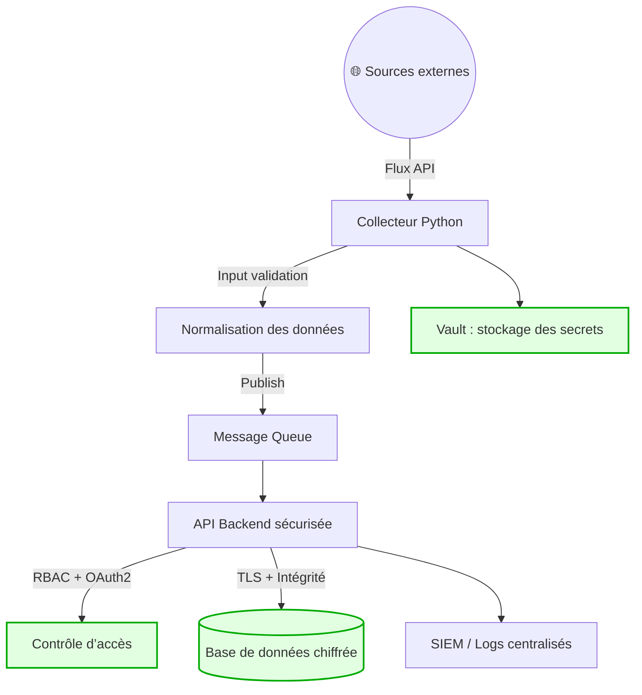

# VTEK - Projet de collecte de données automobiles

## Organisation de l'équipe

- **Guillaume A.** : Responsable sécurité
- **Simon R.** : Tech Lead
- **Eric J.** : Testeur
- **Nicolas P.** : Chef de projet

## Gestion de projet

### Kanban

![[VTEK - Kanban]]

## Présentation du projet

L'application collecte automatiquement des données sur les performances de véhicules automobiles (tous types) en interrogeant diverses sources (API constructeurs, bases publiques, etc.) et permet de comparer ces données dans une interface centralisée

## Architecture

Le cahier des charges impose une architecture 3-tiers :

- **Tier 1 - Présentation** : Interface client / Frontend
- **Tier 2 - Application** : Logique métier et traitements
- **Tier 3 - Données** : Stockage et persistance

### Architecture sécurisée avec zones de sécurité

![[architecture.excalidraw|1500]]

---

# 🎯 Objectif du système

Développer une application permettant :

- De **collecter automatiquement** des données sur des véhicules (API fabricants, bases publiques, capteurs, etc.)
- De **centraliser et comparer** leurs performances dans une interface unique
- De garantir **intégrité, disponibilité et confidentialité** des données tout au long du cycle de vie

---

# 🔐 Principes Security by Design appliqués

## 1. Minimisation du périmètre (Zero Trust)

- L'application Python **ne doit pas avoir plus de droits que nécessaire**
- Accès segmenté en réseau (VLAN, firewall, DMZ)
- Accès aux sources externes via **proxys filtrants**
- Authentification et autorisation systématiques (pas de confiance implicite)

## 2. Gestion des secrets

- Aucun secret dans le code Python
- Utilisation d'un **vault** (Azure KeyVault, HashiCorp Vault, Passbolt)
- Rotation automatique des clés
- Tokens temporaires avec durée de vie limitée

## 3. Dépendances et sécurité de la supply chain

- Analyse SAST/DAST du code
- Immutabilité de l'environnement : conteneur Docker signé
- Pinning des versions (requirements.txt verrouillé)
- Surveillance des CVE des dépendances

## 4. Sécurité des données collectées

- **Chiffrement au repos** : LUKS/GCP CMEK/Azure SSE
- **Chiffrement en transit** : TLS 1.2/1.3 minimum
- Séparation base de production / base d'analyse
- Validation et sanitisation des données en entrée

## 5. Journalisation et détection

- Logs centralisés (Elastic, Loki)
- Audit des accès au collecteur Python
- Alertes en cas de volume anormal de requêtes
- Monitoring des comportements suspects

## 6. Sécurité de l'infrastructure

C'est le cœur du projet : **l'infrastructure Security by Design**.

Elle inclut :

- **Segmentation réseau** : collecteur dans une zone contrôlée (VLAN)
- **Orchestrateur sécurisé** : Docker, Kubernetes, Proxmox avec isolation
- **CI/CD durcie** : pipeline sécurisé avec validation automatique
- **Reverse proxy sécurisé** : NGINX avec headers de sécurité (CSP, HSTS, etc.)
- **Sauvegardes chiffrées** : automatiques et régulièrement testées

### Diagramme de séquence sécurisé

---

# 📉 Analyse des risques

| **Risque**                                   | **Impact**                 | **Mesures Security by Design**               |
| -------------------------------------------- | -------------------------- | -------------------------------------------- |
| Vol d’API key dans le code Python            | Prise de contrôle des APIs | Vault + rotation automatique                 |
| Collecteur compromis                         | Fuite massive              | Segmentation réseau + service account limité |
| Corruption de données                        | Comparaisons faussées      | Hash d’intégrité + DB immuable               |
| Collecte abusive détectée par un fournisseur | Blocage API                | Rate limiting + gestion des quotas           |
| Dépendance compromise                        | Exfiltration               | Scan SAST/DAST + pinned versions             |

# 📦 Mesures techniques recommandées

## Pour l'application Python

- Environnement virtuel (venv) dédié et isolé
- Analyse statique : **bandit** + **pylint** + **mypy**
- Audit des dépendances : **pip-audit** pour détecter les CVE
- Validation des entrées utilisateur
- Gestion des erreurs sécurisée (pas de stack traces exposées)

## Pour l'infrastructure

- **Reverse proxy sécurisé** : NGINX avec configuration durcie
- **Conteneurs sandboxés** : isolation des processus
- **Stockage chiffré** : au repos et en transit
- **Gestion des identités** : MFA obligatoire + RBAC
- **Supervision** : SIEM / SOC pour détection des anomalies
- **Sauvegardes** : régulières, chiffrées et testées

---

# 🧩 Conclusion

Même si l'application Python est simple et sert à collecter des données :

➡️ **Le cœur du projet est la mise en place d'une architecture sécurisée**, pas le code.

> Le code applicatif est développé par une équipe externe. Notre responsabilité est de garantir que l'infrastructure et l'architecture respectent les principes Security by Design.

## Ce que ce projet démontre

- La **gouvernance des identités** et des accès
- La **segmentation réseau** et l'isolation des composants
- La **protection des secrets** via vault
- La **gestion sécurisée des flux** de données
- La **résilience** et la **supervision** continue
- La **défense en profondeur** appliquée à un écosystème de collecte massive

C'est exactement ce qui est attendu dans un projet **Security by Design** moderne.
